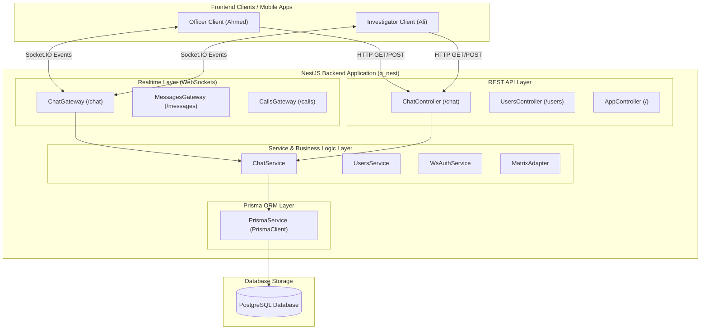
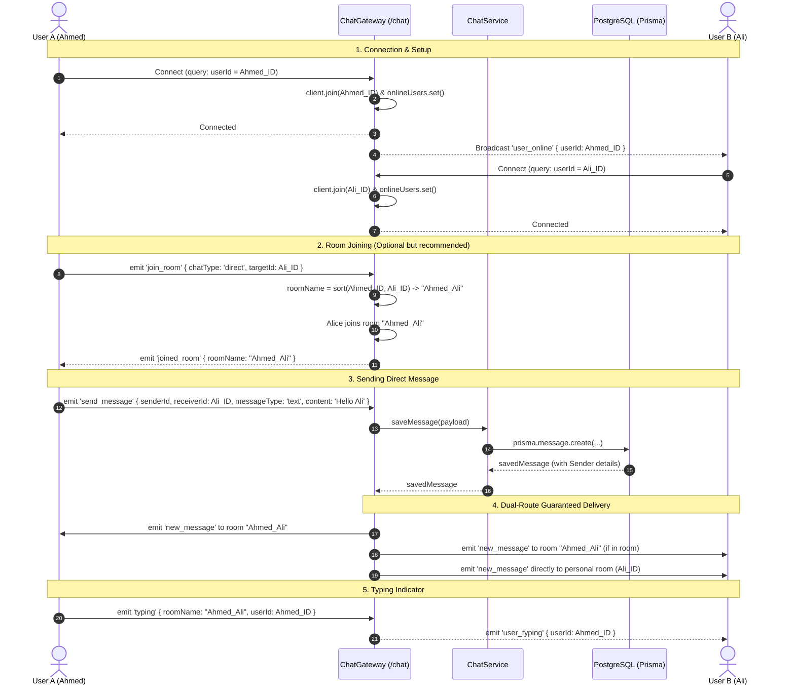
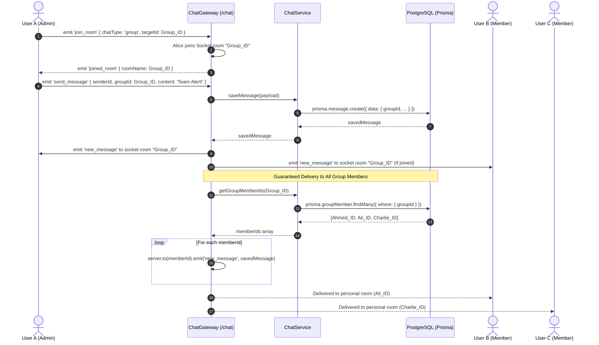
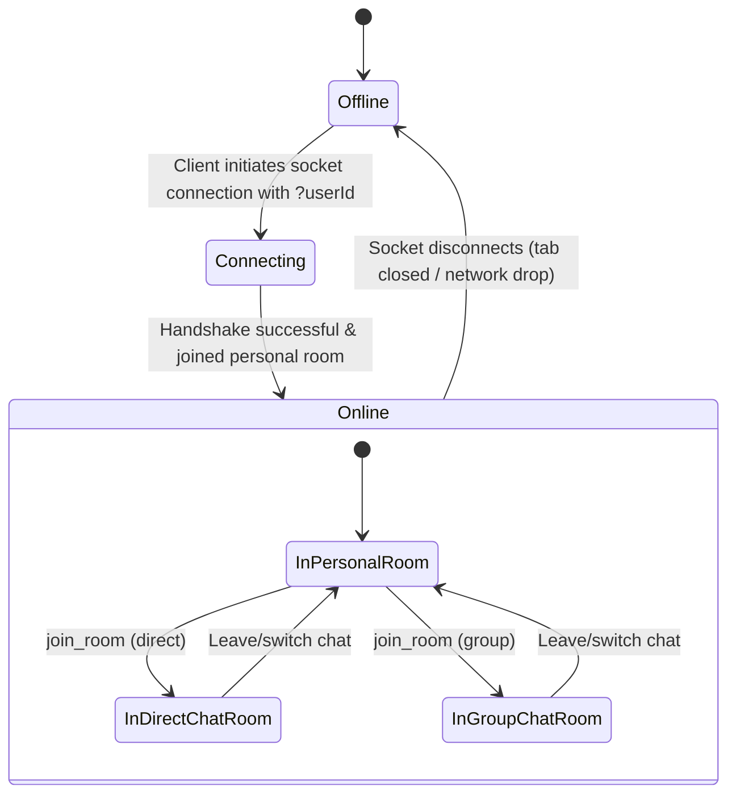
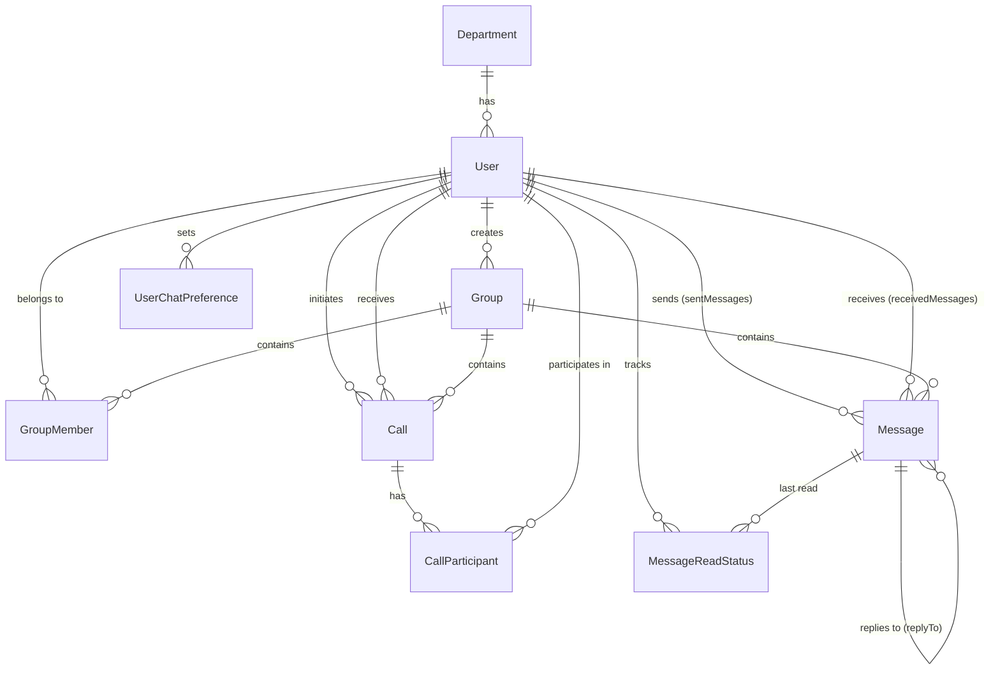
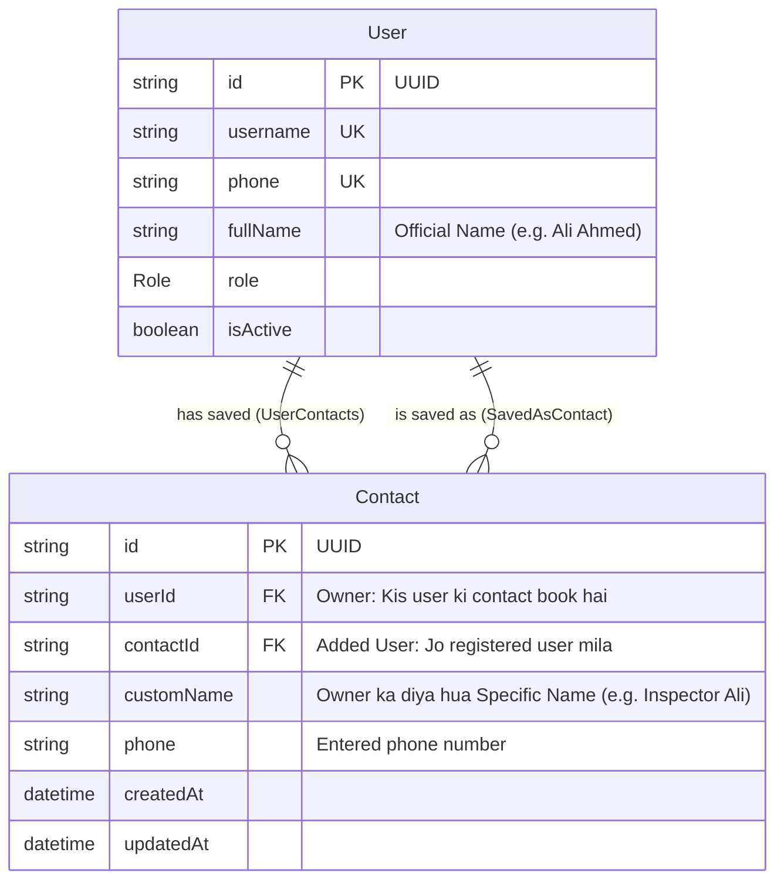
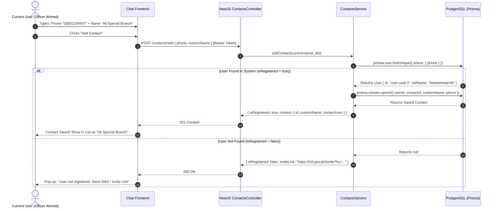

# CTD Backend - Chat Module Documentation & Architecture

Is document me CTD Backend k **Chat Module** ka mukammal workflow, tamam implemented features, architecture/sequence diagrams, database schema, aur har REST API endpoint wa WebSocket event ki tafseel shamil hai.

---

## 📑 Table of Contents
1. [Module Overview](#1-module-overview)
2. [Work Done So Far (Functionalities Implemented)](#2-work-done-so-far-functionalities-implemented)
3. [Architecture & Workflow Diagrams](#3-architecture--workflow-diagrams)
   - [High-Level Architecture](#31-high-level-architecture)
   - [Direct Messaging Workflow Diagram](#32-direct-messaging-workflow-diagram)
   - [Group Messaging Workflow Diagram](#33-group-messaging-workflow-diagram)
   - [Presence & Online/Offline Lifecycle](#34-presence--onlineoffline-lifecycle)
4. [Complete Endpoints Reference](#4-complete-endpoints-reference)
   - [HTTP REST Endpoints](#41-http-rest-endpoints)
   - [WebSocket Gateway Events (`/chat` Namespace)](#42-websocket-gateway-events-chat-namespace)
   - [Additional Gateways & Services (Prototype/Staging)](#43-additional-gateways--services-prototypestaging)
5. [Database Schema & Data Models](#5-database-schema--data-models)
6. [Codebase Structure & File Mapping](#6-codebase-structure--file-mapping)
7. [Testing & Verification Guide](#7-testing--verification-guide)
8. [Pending / Next Phase Roadmap](#8-pending--next-phase-roadmap)
9. [Contact Management Architecture & Workflow (Add Contact Flow)](#9-contact-management-architecture--workflow-add-contact-flow)
   - [Overview & Requirements](#91-overview--requirements)
   - [High-Level Architecture](#92-high-level-architecture)
   - [Workflow & Decision Logic](#93-workflow--decision-logic)
   - [Database Architecture & ER Diagram](#94-database-architecture--er-diagram)
   - [Sequence Diagram (Client-Server-DB Flow)](#95-sequence-diagram-client-server-db-flow)
   - [REST API Specifications](#96-rest-api-specifications)

---

## 1. Module Overview

Chat Module CTD (Counter Terrorism Department) platform ka real-time communication backbone hai. Ye module secure 1-on-1 direct messaging, group communication, user presence tracking, aur call signaling support provide karta hai.

### Core Tech Stack:
- **Framework:** NestJS (Node.js with TypeScript)
- **Realtime Engine:** `@nestjs/websockets` + Socket.IO v4
- **Database & ORM:** PostgreSQL + Prisma ORM
- **Validation:** `class-validator` + `class-transformer`
- **Future Interoperability:** Matrix protocol compatible data fields (`matrixEventId`)

---

## 2. Work Done So Far (Functionalities Implemented)

Abhi tak chat module me darj zail kaam mukammal ho chuka hai:

### ✅ 1. Realtime WebSocket Gateway (`/chat` namespace)
- **Automatic User Authentication & Binding:** Jab client connect hota hai (`?userId=UUID`), socket connection handshake se `userId` verify karta hai aur user ko us k unique personal room (`client.join(userId)`) me join karata hai.
- **Online/Offline Presence Tracking:** 
  - User connect hone par `user_online` event globally broadcast hota hai.
  - User disconnect hone par in-memory map se socket clean hoti hai aur `user_offline` event broadcast hota hai.
- **Dynamic Room Management (`join_room`):**
  - **Direct Chat:** Dono user IDs ko alphabetically sort kar k deterministic room ID banata hai (`[userId1, userId2].sort().join('_')`). Is se dono users hamesha same room me synchronize hote hain chahe jis ne bhi pehle room open kiya ho.
  - **Group Chat:** `groupId` ko as room name use karta hai.
- **Guaranteed Message Delivery:**
  - **Direct Chat:** Message active chat room me broadcast hota hai PLUS receiver k personal room me bhi direct emit hota hai. Is tarah agar receiver ne chat window open nahi bhi ki hui tab bhi usko notification/message receive ho jata hai.
  - **Group Chat:** Group room me emit hota hai PLUS database se group k tamam members ki IDs query kar k har member k personal room me deliver hota hai.
- **Realtime Typing Indicator (`typing`):**
  - Jab koi user type karta hai to target room me `user_typing` event emit hota hai.
- **Error Feedback Handling (`chat_error`):**
  - Foreign key violations (Prisma error `P2003` - agar sender, receiver ya group database me exist na kare) ko gracefully handle kar k client ko human-readable error send karta hai.

### ✅ 2. Database Integration & Persistence (`ChatService`)
- **`saveMessage`:** Message ko PostgreSQL database me insert karta hai jisme sender details, receiver/group relations, messageType, content, optional media metadata, aur random `matrixEventId` save hota hai. Sender ka object (`id`, `fullName`, `username`) return karta hai.
- **`getDirectMessages`:** Dono users k darmiyan tamam non-deleted messages chronological order (`sentAt asc`) me database se fetch karta hai.
- **`getGroupMessages`:** Group k tamam non-deleted messages fetch karta hai.
- **`getGroupMemberIds`:** Group members ki list nikalta hai taakay guaranteed message broadcast ho sake.

### ✅ 3. REST API Controllers (`ChatController`)
- Messages ki historical chat retrieve karne k liye REST endpoints expose kiye gaye hain taakay client initial load ya reload par pichli chats dekh sake.

### ✅ 4. Data Transfer Objects (DTOs) with Strict Validation
- **`SendMessageDto`:** Validates `senderId`, optional `receiverId`/`groupId`, `messageType` enum (`text`, `image`, `video`, `voice`, `file`), `content`, `mediaUrl`, `mediaDuration`, `mediaSize`, and `replyToId`.
- **`JoinRoomDto`:** Validates `chatType` (`'direct' | 'group'`) and `targetId`.

### ✅ 5. Complete Database Schema (Prisma)
- Chat aur calls k related tamam models schema me design ho chuke hain:
  - `User`, `Department`, `Group`, `GroupMember`
  - `Message`, `Call`, `CallParticipant`
  - `UserChatPreference`, `MessageReadStatus`

### ✅ 6. Live Socket Test Client (`index.html`)
- Root directory par ek complete frontend test interface mojood hai jisme:
  - Presets buttons hain: "Login as Officer Ahmed", "Login as Investigator Ali", "Set Group Chat (CTD QRU)".
  - Realtime socket connect/disconnect buttons.
  - Room join karne ka form.
  - Message send karne aur live event log monitor karne ka display.

### ✅ 7. Database Seeding Script (`seed.ts`)
- Ek click par CTD Sindh department, 2 users (Officer Ahmed aur Investigator Ali), aur 1 group (CTD QRU) create karne ka script jo instant testing k liye ready hai.

---

## 3. Architecture & Workflow Diagrams

### 3.1 High-Level Architecture



---

### 3.2 Direct Messaging Workflow Diagram



---

### 3.3 Group Messaging Workflow Diagram



---

### 3.4 Presence & Online/Offline Lifecycle



---

## 4. Complete Endpoints Reference

### 4.1 HTTP REST Endpoints

Base URL: `http://localhost:3000` (ya server PORT)

#### 🔹 1. Get Direct Chat History
- **Endpoint:** `GET /chat/direct/:userId1/:userId2`
- **Controller:** `ChatController.getDirectMessages`
- **Purpose:** Do users k darmiyan exchange hue tamam messages chronological order me lena.
- **Parameters:**
  - `userId1` *(string, path param)*: Pehle user ka UUID.
  - `userId2` *(string, path param)*: Doosre user ka UUID.
- **Sample Request:**
  ```http
  GET /chat/direct/00000000-0000-0000-0000-000000000001/00000000-0000-0000-0000-000000000002 HTTP/1.1
  Host: localhost:3000
  ```
- **Sample Response (200 OK):**
  ```json
  [
    {
      "id": "18f26db9-74d6-44ec-b827-b08e2f6ae64d",
      "matrixEventId": "9b1deb4d-3b7d-4bad-9bdd-2b0d7b3dcb6d",
      "senderId": "00000000-0000-0000-0000-000000000001",
      "receiverId": "00000000-0000-0000-0000-000000000002",
      "groupId": null,
      "messageType": "text",
      "content": "Report ready hai?",
      "mediaUrl": null,
      "mediaDuration": null,
      "mediaSize": null,
      "replyToId": null,
      "isDeleted": false,
      "sentAt": "2026-09-02T10:00:00.000Z",
      "editedAt": null
    }
  ]
  ```

---

#### 🔹 2. Get Group Chat History
- **Endpoint:** `GET /chat/group/:groupId`
- **Controller:** `ChatController.getGroupMessages`
- **Purpose:** Kisi specific group k tamam non-deleted messages chronological order me lena.
- **Parameters:**
  - `groupId` *(string, path param)*: Group ka UUID.
- **Sample Request:**
  ```http
  GET /chat/group/00000000-0000-0000-0000-000000000010 HTTP/1.1
  Host: localhost:3000
  ```
- **Sample Response (200 OK):**
  ```json
  [
    {
      "id": "22a33f11-92b1-4cd4-88bc-4672e8bc5911",
      "matrixEventId": "0f2495d2-f472-4d1a-be19-9ce7aa15de23",
      "senderId": "00000000-0000-0000-0000-000000000001",
      "receiverId": null,
      "groupId": "00000000-0000-0000-0000-000000000010",
      "messageType": "text",
      "content": "All units report to sector 4",
      "mediaUrl": null,
      "mediaDuration": null,
      "mediaSize": null,
      "replyToId": null,
      "isDeleted": false,
      "sentAt": "2026-09-02T10:05:00.000Z",
      "editedAt": null
    }
  ]
  ```

---

#### 🔹 3. Health Check
- **Endpoint:** `GET /`
- **Controller:** `AppController.getHealth`
- **Purpose:** API server status check karna.
- **Sample Response (200 OK):**
  ```json
  {
    "status": "ok",
    "service": "CTD NestJS Backend API",
    "timestamp": "2026-09-02T15:58:00.000Z"
  }
  ```

---

#### 🔹 4. Users Endpoints (Associated / Auxiliary)
- `GET /users` - Tamam registered users ki list fetch karna.
- `GET /users/:id` - Kisi user ki profile details fetch karna.
- `POST /users` - Naya user register karna (`username`, `cnic`, `phone`, `password`, `fullName`, `role`).

---

### 4.2 WebSocket Gateway Events (`/chat` Namespace)

- **Socket URL:** `ws://localhost:3000/chat` (HTTP transport: `http://localhost:3000/chat`)
- **Handshake Query Parameter:** `userId` (Required! Agar missing ho to connection disconnect ho jayega).

#### 🟢 Client-to-Server Events (Jo Frontend Bhejta Hai)

| Event Name | Parameter / DTO | Description |
|---|---|---|
| `join_room` | `JoinRoomDto` | Kisi direct ya group room ko join karne k liye. |
| `send_message` | `SendMessageDto` | Direct ya group message send aur database me save karne k liye. |
| `typing` | `{ roomName: string, userId: string }` | Typing status broadcast karne k liye. |

##### DTO Details:

1. **`join_room` Payload:**
   ```json
   {
     "chatType": "direct", // "direct" | "group"
     "targetId": "00000000-0000-0000-0000-000000000002" // Target User ID ya Group ID
   }
   ```

2. **`send_message` Payload (Direct Chat):**
   ```json
   {
     "senderId": "00000000-0000-0000-0000-000000000001",
     "receiverId": "00000000-0000-0000-0000-000000000002",
     "messageType": "text", // "text" | "image" | "video" | "voice" | "file"
     "content": "Assalam o Alaikum, status update kya hai?",
     "mediaUrl": null,       // Optional: Media URL agar image/video ho
     "mediaDuration": null,  // Optional: Voice note/audio seconds me
     "mediaSize": null,      // Optional: File size bytes me
     "replyToId": null       // Optional: Kisi pichle message ka UUID agar reply ho
   }
   ```

3. **`send_message` Payload (Group Chat):**
   ```json
   {
     "senderId": "00000000-0000-0000-0000-000000000001",
     "groupId": "00000000-0000-0000-0000-000000000010",
     "messageType": "text",
     "content": "Urgent alert for all group officers"
   }
   ```

4. **`typing` Payload:**
   ```json
   {
     "roomName": "00000000-0000-0000-0000-000000000001_00000000-0000-0000-0000-000000000002",
     "userId": "00000000-0000-0000-0000-000000000001"
   }
   ```

---

#### 🔵 Server-to-Client Events (Jo Frontend Listen Karta Hai)

| Event Name | Emitted To | Payload Format | Description |
|---|---|---|---|
| `user_online` | All connected clients | `{ "userId": "UUID" }` | Jab koi user online aata hai. |
| `user_offline` | All connected clients | `{ "userId": "UUID" }` | Jab koi user disconnect hota hai. |
| `joined_room` | Caller socket | `{ "roomName": "room_string" }` | Room successfully join hone par confirmation. |
| `new_message` | Target room + Personal room(s) | Full Message Object (including sender) | Naya message deliver hone par. |
| `user_typing` | Target room | `{ "userId": "UUID" }` | Jab room ka koi user type kar raha ho. |
| `chat_error` | Caller socket | `{ "message": "error description", "code": "P2003" }` | Agar message save karne me koi error aaye (jaise invalid UUID). |

##### Sample `new_message` Payload:
```json
{
  "id": "58e1c6b1-3fa4-4d89-bb02-e2c72b22f462",
  "matrixEventId": "9b1deb4d-3b7d-4bad-9bdd-2b0d7b3dcb6d",
  "senderId": "00000000-0000-0000-0000-000000000001",
  "receiverId": "00000000-0000-0000-0000-000000000002",
  "groupId": null,
  "messageType": "text",
  "content": "Assalam o Alaikum, status update kya hai?",
  "mediaUrl": null,
  "mediaDuration": null,
  "mediaSize": null,
  "replyToId": null,
  "isDeleted": false,
  "sentAt": "2026-09-02T10:45:00.000Z",
  "editedAt": null,
  "sender": {
    "id": "00000000-0000-0000-0000-000000000001",
    "fullName": "Ahmed Abbasi",
    "username": "officer_ahmed"
  }
}
```

---

### 4.3 Additional Gateways & Services (Prototype/Staging)

1. **`MessagesGateway` (`/messages` namespace):**
   - Socket endpoint: `ws://localhost:3000/messages`
   - Subscribed Event: `sendMessage` (Logs payload and acknowledges with `messageSent`).
2. **`CallsGateway` (`/calls` namespace):**
   - Socket endpoint: `ws://localhost:3000/calls`
   - Subscribed Events: `callOffer` (WebRTC offer ACK), `callAnswer` (WebRTC answer ACK).
3. **`MatrixAdapter` (`src/adapters/matrix`):**
   - Methods: `sendDirectMessage(roomId, message)`, `createRoom(name, topic)` (Stubbed for matrix homeserver integration).

---

## 5. Database Schema & Data Models

Prisma file: `q_nest/prisma/schema.prisma`

### Models Relationship Diagram:



### Models Summary:

| Model Name | Table Name | Purpose | Key Fields |
|---|---|---|---|
| `User` | `users` | System users (Officers, Investigators, Admins) | `id`, `username`, `fullName`, `cnic`, `phone`, `role`, `departmentId` |
| `Department` | `departments` | Organizational unit (e.g. CTD Sindh) | `id`, `name`, `createdAt` |
| `Group` | `groups` | Group chat container | `id`, `groupName`, `createdBy`, `createdAt` |
| `GroupMember` | `group_members` | Group membership with role | `id`, `groupId`, `userId`, `roleInGroup` (`admin`, `member`), `joinedAt` |
| `Message` | `messages` | Chat messages (Direct & Group) | `id`, `matrixEventId`, `senderId`, `receiverId`, `groupId`, `messageType`, `content`, `mediaUrl`, `replyToId`, `isDeleted`, `sentAt` |
| `Call` | `calls` | Audio/Video calls session record | `id`, `initiatedBy`, `receiverId`, `groupId`, `callType` (`voice`, `video`), `status` (`ongoing`, `completed`, `missed`, `rejected`) |
| `CallParticipant` | `call_participants` | Call participant join/leave tracking | `id`, `callId`, `userId`, `joinedAt`, `leftAt` |
| `UserChatPreference`| `user_chat_preferences` | Favorites, Pinning, and Muting chats | `id`, `userId`, `chatType`, `targetId`, `isFavourite`, `isPinned`, `isMuted` |
| `MessageReadStatus` | `message_read_statuses` | Read receipts and unread tracking | `id`, `userId`, `chatType`, `targetId`, `lastReadMessageId`, `lastReadAt` |

---

## 6. Codebase Structure & File Mapping

```
q_nest/
├── prisma/
│   └── schema.prisma                 # Tamam database tables & relationships
├── seed.ts                           # Sample database seeding script
├── src/
│   ├── app.module.ts                 # Root NestJS module importing ChatModule
│   ├── app.controller.ts             # Health check endpoint
│   ├── main.ts                       # App bootstrap, CORS, Global Pipes
│   ├── adapters/
│   │   └── matrix/
│   │       └── matrix.adapter.ts     # Matrix homeserver adapter stub
│   ├── gateways/
│   │   ├── gateways.module.ts        # Realtime Gateways module
│   │   ├── messages.gateway.ts       # /messages WebSocket gateway (staging)
│   │   ├── calls.gateway.ts          # /calls WebRTC signaling gateway
│   │   └── ws-auth.service.ts        # WebSocket auth validator
│   └── modules/
│       ├── chat/                     # 🌟 MAIN CHAT MODULE 🌟
│       │   ├── chat.module.ts        # Module definition registering gateway & service
│       │   ├── controllers/
│       │   │   ├── chat.controller.ts# GET direct & group message history
│       │   │   ├── call.controller.ts# [Placeholder] for Call REST APIs
│       │   │   └── group.controller.ts# [Placeholder] for Group CRUD REST APIs
│       │   ├── dto/
│       │   │   ├── send-message.dto.ts # Validation for sending messages
│       │   │   └── join-room.dto.ts    # Validation for joining rooms
│       │   ├── gateways/
│       │   │   └── chat.gateway.ts   # Core WebSocket gateway (/chat namespace)
│       │   └── services/
│       │       └── chat.service.ts   # Database operations for messages & rooms
│       └── users/
│           ├── users.module.ts       # Users module
│           ├── controllers/users.controller.ts # User CRUD endpoints
│           └── services/users.service.ts       # User service
└── index.html                        # 🧪 Interactive Browser Test Client (root)
```

---

## 7. Testing & Verification Guide

Aap chat module ko asaani se test kar sakte hain:

### Step 1: Database Setup & Seed
Make sure PostgreSQL is running and `.env` has valid `DATABASE_URL`. Run:
```bash
cd q_nest
npx prisma db push
npm run seed
```
Ye script pre-set UUIDs create karega:
- **Officer Ahmed:** `00000000-0000-0000-0000-000000000001`
- **Investigator Ali:** `00000000-0000-0000-0000-000000000002`
- **CTD QRU Group:** `00000000-0000-0000-0000-000000000010`

### Step 2: Start NestJS Backend
```bash
npm run start:dev
```
Backend `http://localhost:3000` par run ho jayega.

### Step 3: Open Test Client
Browser me `index.html` open karein (file direct browser me open karein ya Live Server se run karein):
1. **Window 1:** Click **"Login as Officer Ahmed"** -> Click **"Connect Socket"**.
2. **Window 2 (Incognito / Doosra tab):** Click **"Login as Investigator Ali"** -> Click **"Connect Socket"**.
3. Dono windows me `user_online` presence update nazar aayegi.
4. Message type karein aur Send karein:
   - Dono windows me real-time message live synchronize hoga!
   - Database me message persist hoga.
5. Message history check karne k liye browser me hit karein:
   `http://localhost:3000/chat/direct/00000000-0000-0000-0000-000000000001/00000000-0000-0000-0000-000000000002`

---

## 8. Pending / Next Phase Roadmap

Aane wale phases me darj zail features add kiye ja sakte hain:

1. **Group CRUD APIs (`group.controller.ts`):**
   - Create group, add members, remove members, change member roles (`admin`/`member`).
2. **Call Management APIs & Full WebRTC (`call.controller.ts` & `CallsGateway`):**
   - Call initiate karna, call status update (`missed`, `ongoing`, `completed`, `rejected`), ICE candidate exchange.
3. **Media Upload Support (Files, Audio/Voice, Images, Videos):**
   - NestJS Multer / MinIO / S3 integration taakay `mediaUrl`, `mediaDuration`, `mediaSize` populate ho sakein.
4. **Message Read Receipts & Unread Counters (`MessageReadStatus`):**
   - `mark_as_read` event aur unread message count API.
5. **Chat Preferences (`UserChatPreference`):**
   - Pin chat (`isPinned`), Mute notifications (`isMuted`), Favorite contacts (`isFavourite`).
6. **Message Actions:**
   - Soft-delete message (`isDeleted: true`), Edit message (`editedAt`).

---

## 9. Contact Management Architecture & Workflow (Add Contact Flow)

### 9.1 Overview & Requirements
Jab user Chat component me aata hai aur **"Add New Contact"** button par click karta hai:
1. User phone number aur ek custom specific name (nickname) input karega.
2. Backend database me check karega:
   - **Case YES (Number exists in DB):** Current user ke personal contact book me us registered user ko custom name ke sath save kiya jayega.
   - **Case NO (Number does not exist in DB):** User ko invite link return ki jayegi taakay wo SMS ya messaging ke zariye us user ko app par invite kar sake.

---

### 9.2 High-Level Architecture

```mermaid
graph TD
    subgraph Frontend ["Client Side (Chat UI)"]
        UI["User Clicks '+ Add New Contact'"]
        InputModal["Modal: Input Phone Number + Custom Name"]
        InviteUI["Show Invite Modal / Share Link"]
        ContactListUI["Update Contact List in UI"]
    end

    subgraph Backend ["NestJS Backend (q_nest)"]
        Controller["ContactsController (POST /contacts/add)"]
        DTOValidation["Class-Validator (E.164 Phone, Name, Not-Self)"]
        Service["ContactsService (Business Logic)"]
    end

    subgraph Database ["PostgreSQL (Prisma ORM)"]
        UsersTable[("users Table")]
        ContactsTable[("contacts Table")]
    end

    UI --> InputModal
    InputModal -->|HTTP POST payload| Controller
    Controller --> DTOValidation
    DTOValidation --> Service
    
    Service -->|1. Query Phone| UsersTable
    UsersTable -->|Return User or Null| Service

    Service -->|2a. If Exists: Save Record| ContactsTable
    ContactsTable -->|Contact Saved| Service
    Service -->|Return { isRegistered: true, contact }| Controller
    Controller --> ContactListUI

    Service -->|2b. If Not Exists: Generate Invite| Controller
    Controller -->|Return { isRegistered: false, inviteLink }| InviteUI
```

---

### 9.3 Workflow & Decision Logic

```mermaid
flowchart TD
    Start([User opens Chat & clicks 'Add Contact']) --> FormInput[/Enter Phone Number & Specific Name/]
    FormInput --> Submit[Click 'Save / Add']
    
    Submit --> ClientValidation{Client Validation:<br/>Valid Phone? Not Own Number?}
    ClientValidation -- Invalid --> ClientError[Show Error: 'Invalid phone or cannot add yourself']
    ClientValidation -- Valid --> APIRequest[POST /contacts/add]

    APIRequest --> BackendGuard[Auth Guard: Get Current User ID]
    BackendGuard --> CheckSelf{phone == currentUser.phone?}
    CheckSelf -- Yes --> ReturnBadRequest[Return 400: 'Cannot add yourself as contact']
    CheckSelf -- No --> QueryDB[(Query: prisma.user.findUnique by phone)]

    QueryDB --> ExistsInDB{User found in DB?}

    %% Branch NO
    ExistsInDB -- No --> GenInvite[Generate Invite Link / Token]
    GenInvite --> ReturnInvite[Response: 200 OK<br/>{ isRegistered: false, inviteLink: '...' }]
    ReturnInvite --> ShowInviteModal[UI: 'User not on CTD app yet.<br/>Click to Share / Send Invite Link']

    %% Branch YES
    ExistsInDB -- Yes --> CheckDuplicate[(Check: Already in contacts table?)]
    CheckDuplicate -- Already Exists --> UpdateOrError{Action}
    UpdateOrError -- Update Name --> UpdateContact[(Update customName in contacts)]
    UpdateOrError -- Reject --> ReturnConflict[Return 409: 'Contact already in your list']
    
    CheckDuplicate -- Not Added Yet --> InsertContact[(Insert into contacts:<br/>userId = currentUser.id<br/>contactId = foundUser.id<br/>customName = inputName<br/>phone = inputPhone)]
    InsertContact --> ReturnSuccess[Response: 201 Created<br/>{ isRegistered: true, contact: { ... } }]
    ReturnSuccess --> AddToUIList[UI: Add to Contact List with customName & show 'Start Chat' button]
```

---

### 9.4 Database Architecture & ER Diagram

Current user ka specific name unki personal contact book tak mehdood rakhne k liye `Contact` model design kiya gaya hai:



#### Prisma Schema Definition:

```prisma
model Contact {
  id          String   @id @default(uuid())
  
  // Jo user contact save kar raha hai
  userId      String
  user        User     @relation("UserContacts", fields: [userId], references: [id], onDelete: Cascade)

  // Wo user jo DB mein mila (Registered User)
  contactId   String?
  contactUser User?    @relation("SavedAsContact", fields: [contactId], references: [id], onDelete: Cascade)

  // Current user ka diya hua custom specific name
  customName  String
  
  // Entered phone number
  phone       String

  createdAt   DateTime @default(now())
  updatedAt   DateTime @updatedAt

  @@unique([userId, phone]) // Aik user same number do dafa add na kare
  @@map("contacts")
}
```

---

### 9.5 Sequence Diagram (Client-Server-DB Flow)



---

### 9.6 REST API Specifications

| Method | Endpoint | Description | Request Body | Response |
| :--- | :--- | :--- | :--- | :--- |
| **POST** | `/contacts/add` | Check phone & add contact or return invite link | `{ "phone": "03001234567", "customName": "Ali Bhai" }` | `{ isRegistered: boolean, contact?, inviteLink? }` |
| **GET** | `/contacts` | Current user ke tamam saved contacts fetch karna | *None (uses Auth Token)* | `Array<Contact & { contactUser: { id, fullName, phone, isOnline } }>` |
| **PATCH** | `/contacts/:id` | Contact ka custom name update karna | `{ "customName": "New Name" }` | Updated Contact |
| **DELETE** | `/contacts/:id` | Contact ko delete karna | *None* | `{ success: true }` |
